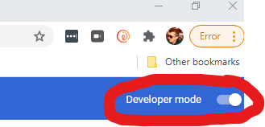

# Msc Thesis Project Main Repository

Msc Creative Computing 2019-2020 Msc Final Thesis Project

By: Stuart Leitch

Supervisor: Mick Grierson

Date: November 27th, 2020

## Table of Contents:
* Companion Repositories
* Installation Instructions
* Introduction
* Project Journal
* Apache notes
* Useful links

## Companion Repositories
1. [Jupyter Notebooks](https://github.com/Toruitas/msc-notebooks)
2. [Backend Server](https://github.com/Toruitas/msc-backend)
3. [Chrome Extension](https://github.com/Toruitas/msc-extension)

## Installation Instructions
### Backend server

Just your typical Python setup - using either venv or Py Poetry. 

Linux/Mac instructions are as follows:
1. `git clone https://github.com/toruitas/msc-backend mscbackend`
2. `cd mscbackend`
3. `python3 -m venv .venv`
4. `source .venv/bin/activate`
5. `pip install -r requirements.txt`
6. Decompress the classifier so that the .pkl file is in the same folder as everything else. `tar -xf final-classifier-2.tar.xz`
7. `export FLASK_APP=app.py`
8. `export FLASK_ENV=development`
9. `flask run`
10. Wait a few minutes for the model to load. It will print "Loading machine learning model." in the console.

### Chrome Extension
0. If you're in mscbackend, `cd ..`
1. `https://github.com/Toruitas/msc-extension mscext`
2. `cd mscext`
3. Open Chrome and in the URL bar, navigate to `chrome://extensions/`
4. In the upper-right corner, enable Developer Mode.

5. On the new navigation bar that enabling Developer Mode has revealed, click "Load unpacked."
6. Find and select the folder `mscext`
7. That's installation complete.

### After installation completes
1. In Chrome, go to [old.reddit.com/r/news](old.reddit.com/r/news)
2. Wait for a while for the titles to be sent to the Flask server for predictions.
3. See the titles change! Beware entering the comments section! It might just make you feel worse about humanity.

## Introduction

It's clear now. The increasingly entrenched socio-political divisions across Western countires pose the most serious threat to... well it wouldn't be too far fetched to say the continued existence of some nations. During the 2020 US Presidential elections, a common question about the result was "Could there be another civil war?" As an American, that doesn't seem like a question you ask a society with broadly accepted values and opinions. No, that's a question asked only when division are so deep they seem impossible to bridge. 

Humans have a biological attraction to bad news. Our monkey brains want to know where every threat is coming from. Remember the old saying "If it bleeds it leads?" First with 24/7 Cable TV and now with the internet, the bleeding has reached new heights. It's gone beyond blood into blood feuds. The news is (in some circles at least) less something to inform, and instead something to push an agenda. 1984 had it wrong. 2 minutes of hate doesn't begin to compare with the onslought of anger Fox News broadcasts daily.

Companies and political parties are not learning that this trend is dangerous. They're learning it is profitable. A divided people is weak and captive.

What about us? We, the people who are flooded by divisive language. What can we do?

Let's just avoid the bad, divisive, controversial news.

This project is an effort to do that, starting by using Machine Learning to identify which submissions on reddit.com/r/news are bad, divisive, and controversial. It's not perfect, but if we can be nudged in a way to read fewer stressful news articles, we'll be better off. 

## Project Journal

### Research stage

### Modeling stage

### Application stage

### Deployment stage

## Apache Notes

`sudo gedit /etc/apache2/ports.conf`
 and change `listened` to 81

`sudo gedit mscbackend.conf`


```
<VirtualHost *:81>
    ServerName mscjetson
	WSGIDaemonProcess mscbackend user=jettoruitas group=jettoruitas threads=5
	WSGIScriptAlias / /var/www/mscbackend/app.wsgi
	<Directory /var/www/mscbackend>
		WSGIProcessGroup mscbackend
		WSGIApplicationGroup %{GLOBAL}
		Require all granted
	</Directory>
	ErrorLog /var/www/mscbackend/logs/error.log
</VirtualHost>
```

`sudo iptables -I INPUT -p tcp -m tcp --dport 81 -j ACCEPT`

`sudo netstat -tnlp | grep :81`

